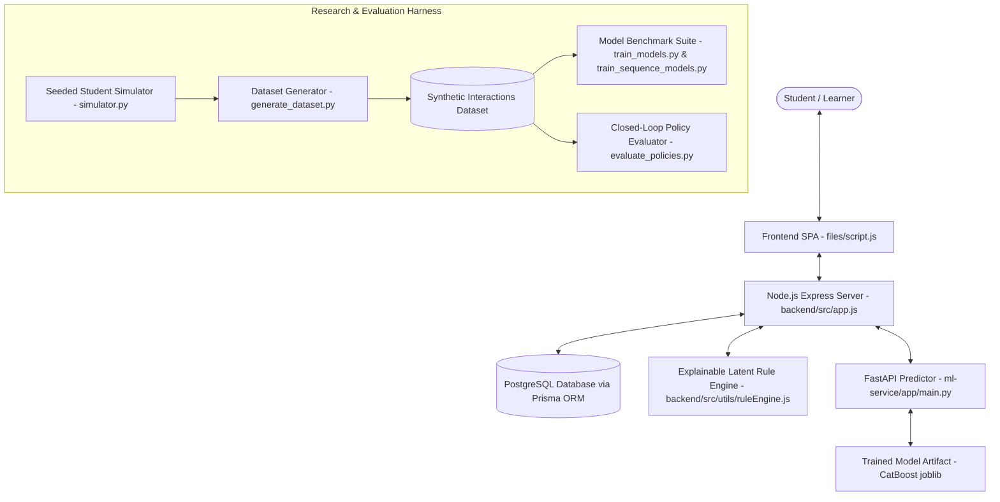
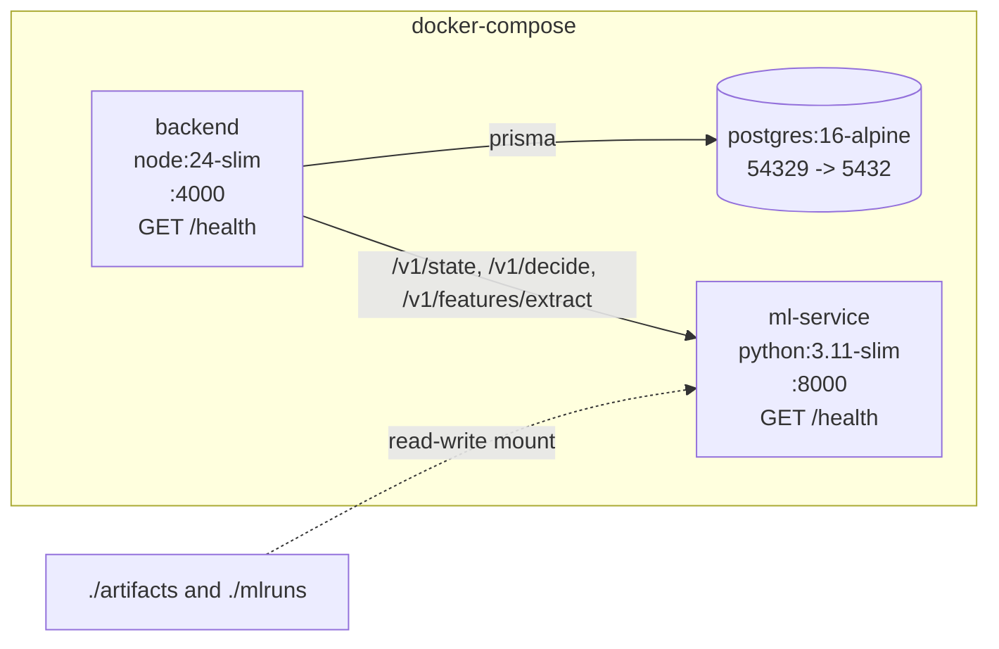
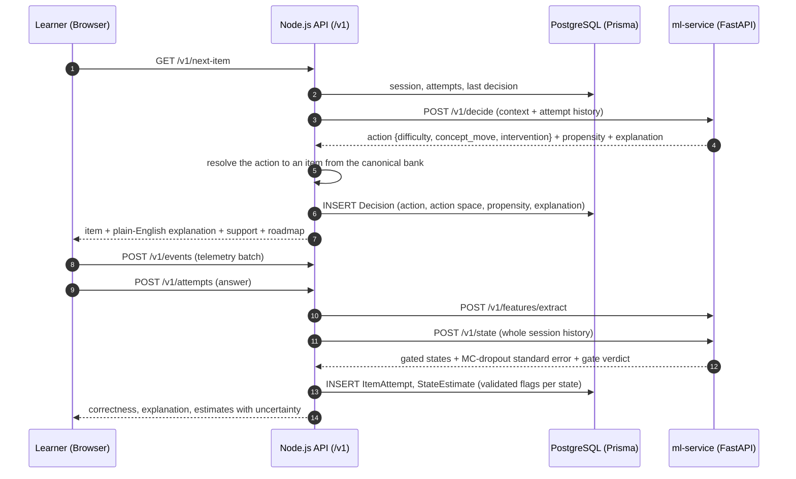

# Adaptive Learning Platform (ALP): Architecture & Design Specification

## System Overview

The Adaptive Learning Platform (ALP) is a research-grade educational technology system engineered to measure the cognitive and behavioral impact of latent-state modeling on student learning efficiency.

---

## Core Components

### 1. Web Application & Client Interface (`files/`)
- **Technology Stack**: HTML5, Vanilla CSS3 (Custom Glassmorphism Design Token System), Modern Vanilla JavaScript (ES2022).
- **Behavioral Instrumentation**: Captures per-question item response time, reading time, interaction latency, retries, option changes, and tab-blur events.

### 2. Backend Orchestrator (`backend/`)
- **Technology Stack**: Node.js, Express, Prisma ORM, PostgreSQL.
- **Question Storage**: `questionBank.service.js` resolves a requested topic to a version-controlled bank file; there is no runtime generation path. A `/v1` research session always uses `item-bank-v1.json`, generated from the canonical Phase 1 bank by `make bank`; the older hand-built banks (126 CSE questions from `question_bank.csv`) remain for the legacy `/question` path.
- **Session Lifecycle**:
  - `POST /question`: Initializes session and stores concept-mapped question bank.
  - `GET /question/start-session`: Fetches initial diagnostic question (easy level).
  - `POST /question/submit`: Validates response, computes 5-dimensional latent state update, requests policy recommendation (Rule vs ML), updates PostgreSQL session state, and selects next optimal item.
  - `GET /roadmap`: Returns the persistent concept prerequisite graph roadmap for a learner.
  - `POST /roadmap/update`: Updates per-learner concept mastery, updates prerequisite DAG state, and persists to PostgreSQL `Learner` table.

### 2b. Dynamic Learning Roadmap Engine (`backend/src/utils/conceptRoadmap.js`)
- **Prerequisite Graph (`backend/src/data/concept_graph.json`)**: 36-concept DAG covering 6 core Computer Science subjects (Data Structures, Algorithms, OOP, DBMS, Operating Systems, Computer Networks).
- **Concept Node States**:
  - `mastered`: Mastery $\ge 0.70$.
  - `in_progress`: Attempted but mastery $< 0.70$.
  - `eligible`: All prerequisite concepts mastered, ready for learning.
  - `locked`: One or more prerequisites unmastered.
- **Target Selection**: Automatically recommends the lowest-mastery `eligible` or `in_progress` concept to guide personalized learning sequences.

### 3. Latent-State Rule Engine (`backend/src/utils/ruleEngine.js`)
- **Latent Dimensions**:
  1. **Knowledge ($\hat{K} \in [0, 1]$)**: Updated via correctness, item difficulty bonus/penalty, multiple attempt decay, and rolling trend.
  2. **Confidence ($\hat{C} \in [0, 1]$)**: Modulated by response time ratio, rapid submission signals, and option switching frequency.
  3. **Engagement ($\hat{E} \in [0, 1]$)**: Sensitive to window switching, pointer movement density, and idle pause duration.
  4. **Cognitive Load ($\hat{L} \in [0, 1]$)**: Derived from difficulty-time incongruity, multiple option toggles, and retry friction.
  5. **Fatigue ($\hat{F} \in [0, 1]$)**: Cumulative metric driven by session duration, question count, and response time drift.

### 3b. Researcher dashboard (`backend/src/controllers/dashboard.controller.js`)
- `GET /research/dashboard` — one server-rendered page over the research tables: sessions with their knowledge trajectories (inline SVG sparklines), the decision log with propensities and explanations, and probe response rates. `?format=json` returns the same data for the Phase 10 figure script; `?session_id=…` returns one session's whole decision log. Read-only, no framework, no answer keys.

### 4. Machine Learning Service (`ml-service/`)
- **Technology Stack**: Python 3.11 (pinned — `pykt-toolkit`, `pyBKT` and `torch` wheels are unreliable on 3.13), FastAPI, Uvicorn, Scikit-Learn, XGBoost, LightGBM, CatBoost, PyTorch.
- **Inference Objective**: Predict probability of next item success ($P(Y_{i+1}=1)$) across difficulty candidates and select the item targeting the **desirable difficulty band** ($\approx 0.72$ target probability).

---

## Deployment Topology

`docker-compose.yml` defines the whole stack. Three services, healthchecks on
all three, and `depends_on: service_healthy` so nothing starts against a
database or a predictor that is not ready.

Both images build from the repository root so the in-image layout mirrors the
repository: `predictor.py` resolves `artifacts/models` by walking three parents
up from `app/model/`, and the research scripts resolve `artifacts/` relative to
the working directory. Mounting `./artifacts` read-write means a pipeline run
inside the container writes straight back to the host tree.

The backend container runs `prisma migrate deploy` before starting, so the
schema is applied from the migration history in `backend/prisma/migrations/`
rather than pushed.

---

## The live adaptive loop (Phase 10)

The research pipeline and the running application are **one system**: the arm
that serves a live decision is the object Phase 8 and Phase 9 evaluated, the
state estimate is Phase 7's encoder behind Phase 7's gate, and the features are
`app.features.extract` — the same module the training matrices were built from.
Nothing is refitted inside a request handler; the artifacts are loaded once, at
first use, through `app/model/registry.py` and the arm builders.

Four properties this loop is built to hold:

1. **One switch, one name.** `ALP_POLICY` (`rule` | `bandit` | `rl`, or any
   Phase 8 arm key) selects the served arm in both services. The old
   `ADAPTIVE_POLICY` spelling is now an error rather than a silent second
   opinion about which policy is live.
2. **The gate reaches the learner.** A construct Phase 7 rejected is absent from
   the state response, absent from the explanation, and stored in
   `StateEstimate` with `*_validated = false`. The UI shows it as *withheld*,
   with the reason, rather than as a number or a blank.
3. **A learner is never blocked on a model.** If the ml-service is unreachable
   or slow (2 s timeout), the loop falls back to the Phase 2 rule engine, logs
   the decision as `rule_improved_fallback`, and surfaces the fallback in the
   response.
4. **Every served item is a logged decision with a propensity**, on both paths.
   Study 3 cannot be re-run on a log that lacks one and it cannot be backfilled.

### The slot pool

`ml-service/app/policy/live.py` gives each live session a **slot** in a fixed
pool (`ALP_LIVE_SLOTS`, default 32) and drives the research arms through the
cohort contract they already have: one estimator steps every slot in lockstep,
one arm chooses per slot. Requests carry the session's whole attempt history, so
a slot that is new, recycled or lost to a restart replays it — the service is
restartable without a session store. `ponytail:` one pool behind one lock; a
second worker gets its own pool, and a session whose slot was evicted pays one
replay.

### The bank

The live bank is generated from the canonical Phase 1 bank by `make bank`
(`app/research/export_bank.py`), carrying each item's concept id, calibrated
*b*, difficulty bin, and the curriculum `closed_loop.select_curriculum` derives
— 60 items over 6 concepts. Before Phase 10 the platform served hand-built topic
files whose "concepts" were subject names and whose difficulty was a word, and
an action chosen by the served policy could not be resolved to an item.

---

## Design Principles & Security Standards

1. **Explainability**: Every adaptive decision includes human-readable action codes and specific behavioral trigger reasons.
2. **Data Minimization**: High-frequency raw pointer coordinates are aggregated on the client; no biometric keylogging is stored.
3. **Deterministic Evaluation**: Research experiments run with the fixed global seed `20260821`, recorded in every output manifest. No experiment depends on a network call or on generated content.
4. **Reproducible Artifacts**: Every number in a document or figure comes from a file under `artifacts/`, and every file under `artifacts/` is reproducible from a `make` target.
