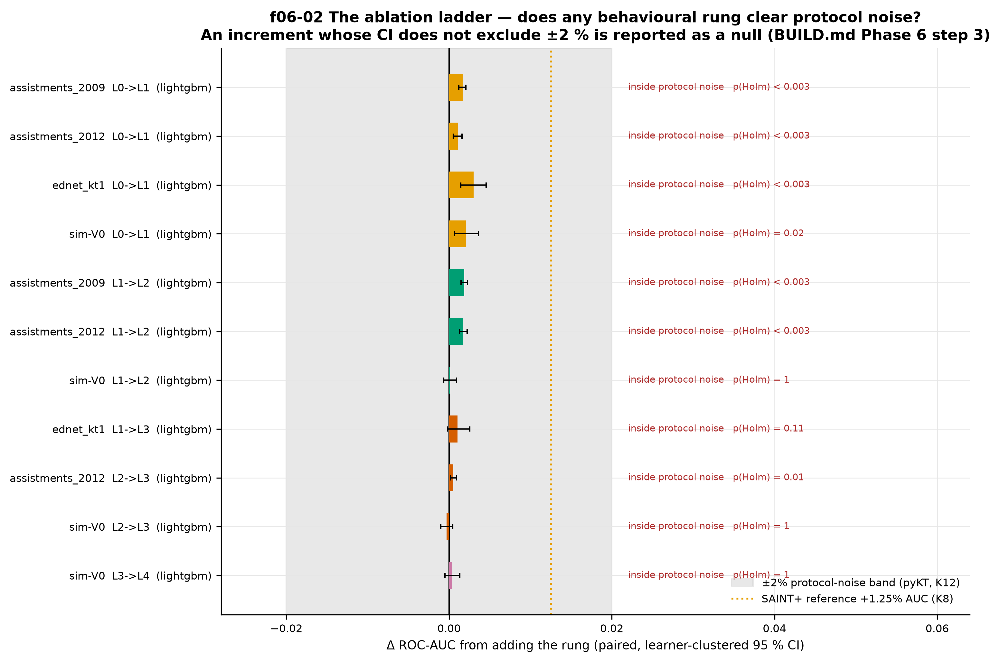
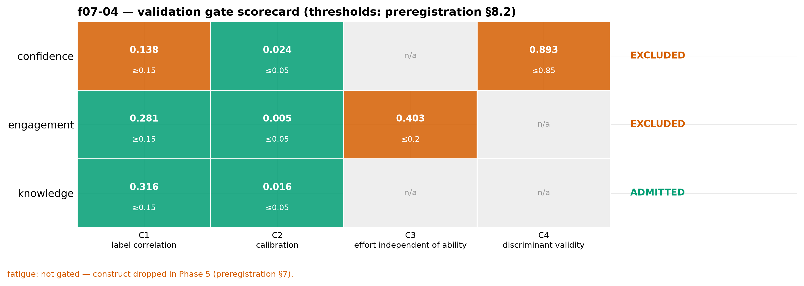
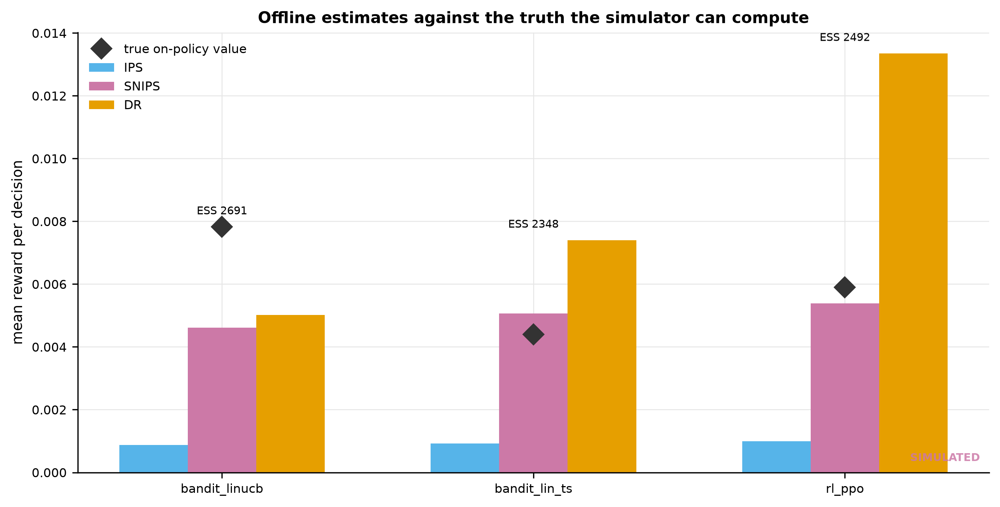
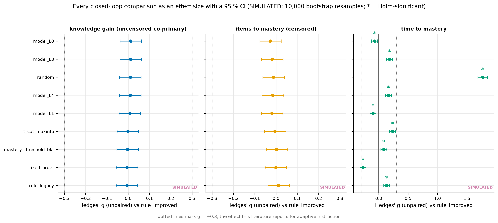
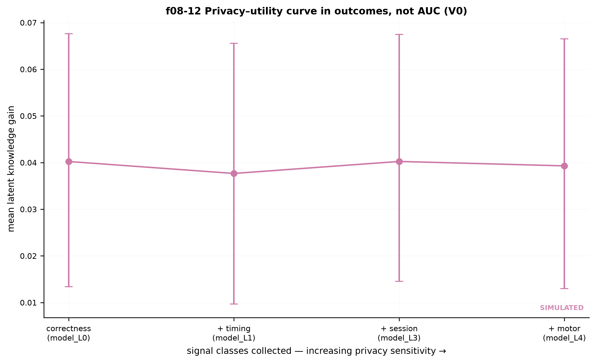
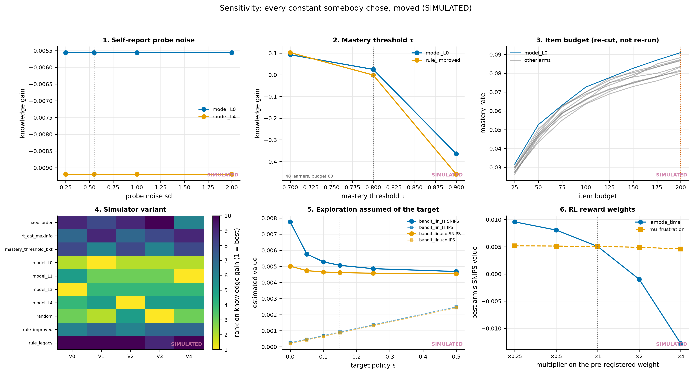

# Estimation is not action: a validated-construct adaptive tutor and a null closed-loop result

*Draft. Every number is read from `artifacts/` when this document is built (`make paper`). Simulated results are labelled simulated wherever they appear. References marked **[S]** have not been verified against the published record and must be checked before submission.*

---

## Abstract

Behaviour-aware knowledge tracing is established: adding timing, interaction and motor signals to a correctness model improves next-item prediction by about one AUC point. Far less is established about the step that follows — whether *acting* on such an estimate teaches better than acting on a simple rule. We build an end-to-end system that closes that loop and report what it measures rather than what we hoped for.

Three archival datasets (ASSISTments 2009 and 2012, EdNet KT1; 129k modelled interactions after learner-level capping and splitting) reproduce the prediction result under a leakage-safe protocol: the best model reaches ROC-AUC {{artifact:artifacts/benchmarks/study1-final.json:sources/assistments_2009/cells/L2|lightgbm/roc_auc}} on ASSISTments 2009, and each behavioural rung of a pre-registered ablation ladder adds a small, positive increment (ΔAUC {{artifact:artifacts/benchmarks/study1-cv.json:sources/assistments_2009/ladder/lightgbm/L1->L2/delta_auc}} for the interaction rung) that survives crossed learner-and-item random effects on three of four datasets. We then treat the four latent constructs the system might act on — knowledge, confidence, engagement, fatigue — as claims requiring validation, and gate them behind pre-registered criteria fixed before the data existed. **One of the four was admitted.** Fatigue was dropped before modelling for want of a defensible label; confidence and engagement failed on correlation, discriminant validity and effort-independence. Only knowledge reaches any policy or any explanation.

In a calibrated simulated closed loop, ten arms — floors, hand-written rules, a maximum-information CAT selector, a BKT mastery-threshold rule, four model rungs, two linear contextual bandits and PPO — compete over 3,000 learners per arm with a 200-item budget. **No arm differs from the strongest hand-written rule on the uncensored co-primary outcome:** every unpaired Hedges' *g* ≤ 0.012 with confidence intervals straddling zero, and nothing is significant before or after Holm correction. Items-to-mastery is {{artifact:artifacts/evaluation/statistical-report.json:censoring/arms/model_L0/censoring_rate}} censored and is analysed as a time-to-event outcome. Off-policy evaluation on a logged ε-greedy policy reproduces the on-policy truth best with self-normalised importance sampling (mean |error| {{artifact:artifacts/evaluation/ope-results.json:mean_absolute_error_vs_truth/snips}} against {{artifact:artifacts/evaluation/ope-results.json:mean_absolute_error_vs_truth/ips}} for IPS), and no learned arm beats the best rule on the reward it optimises.

The contribution is therefore methodological rather than a performance claim: a validity gate that keeps unvalidated constructs out of decisions and out of explanations, a closed loop whose arms are the objects a running service actually serves, an analysis that uses the unpaired effect size and the clustered model, and a reported null. A trial that could detect the effect this literature reports (g = 0.3) at 80 % power would need **{{artifact:artifacts/evaluation/statistical-report.json:power/rct_requirement/n_per_arm}} learners per arm ({{artifact:artifacts/evaluation/statistical-report.json:power/rct_requirement/n_total}} in total)**.

---

## 1. Introduction

An adaptive tutor performs two distinct acts. It **estimates** something about a learner, and it **acts** on that estimate. The literature is heavily weighted towards the first: a decade of knowledge tracing, and a growing body of work adding affective and behavioural signals to it, has established that estimates can be made more accurate. The second act — does the better estimate produce a better decision, and does the better decision produce better learning? — is comparatively unexamined, because measuring it requires either a trial or a closed loop, and both are expensive.

This paper is about that gap, and about two traps in it.

**The first trap is the unvalidated construct.** It is easy to name a network layer "engagement", supervise it against a proxy, and thereafter speak of the system as measuring engagement. Nothing in the training procedure obliges the layer to measure the thing its name promises. If a policy then acts on it, and a UI reports it to a learner, an unvalidated claim has become an intervention.

**The second trap is the flattering evaluation.** A closed loop built on a simulator can be made to produce any result the simulator's assumptions imply. A comparison paired on the same learners can produce an effect size an order of magnitude larger than the unpaired one. An earlier version of this very system reported Cohen's *d* = 26 for a "machine-learning policy" that was reading the simulator's own response function; both errors were in one number.

We take three positions in response. Constructs are gated: a state that fails a pre-registered validity criterion is visible in no policy input and no learner-facing explanation. Simulation is used only where archival data cannot answer the question, is calibrated against real data, and every closed-loop finding is repeated across deliberately mis-specified variants. And the analysis reports the unpaired effect size with a bootstrap interval, crossed random effects for learner and item, Holm correction, and a censored treatment of the primary outcome.

**What this paper claims.** A working end-to-end system in which the served policy is the evaluated policy; a validity gate with three reported failures; a leakage-safe replication of the behavioural-prediction result; and a well-powered, honest null in the simulated closed loop, with the sample size a real trial would need.

**What it does not claim.** That behavioural analytics improves learning outcomes. That the simulated comparison transfers to humans. That any construct beyond knowledge is measured well enough to act on.

---

## 2. Related work

**Psychometrics and adaptive testing.** Item response theory and computerised adaptive testing give the difficulty-selection problem its classical treatment: choose the item of maximum Fisher information at the current ability estimate [S]. That selector is included here as an arm (`irt_cat_maxinfo`), because a new policy that cannot beat maximum-information selection has not earned its complexity.

**Knowledge tracing.** From BKT [S] through deep knowledge tracing and its successors — **DKT**, **SAKT**, **SAINT+**, **LPKT**, **DASKT** [S] — the field has optimised next-item correctness prediction. Two things in that literature bear directly on this work. First, benchmark comparisons are unreliable when splits are made at the interaction rather than the learner level; the pyKT audit [S] showed how much of the reported progress that accounts for, and we follow its protocol. Second, **the addition of behavioural and affective features to knowledge tracing is closed territory**: DASKT and SAINT+ already report the gain. We replicate it; we do not claim it.

**Behavioural and affective analytics.** Response-time effort measures, rapid-guessing detection, cursor and interaction signals, and self-report probes each have their own validation literature [S]. Where this work differs is in refusing to use a construct it has not validated, and in reporting the constructs that failed.

**Sequential decision-making in education.** Bandits and reinforcement learning have been applied to instructional sequencing, usually evaluated in simulation and occasionally in deployment [S]. The methodological hazard is well documented: off-policy evaluation without logged propensities is not identified, and hint-request endogeneity under an adaptive policy is a specific trap. We log propensities for every decision and report effective sample size beside every estimate.

**Positioning.** Against DASKT, SAINT+ and LPKT this paper adds nothing to prediction. It differs in what happens *after* the prediction: the validity gate, the shared action space across rule, model and learned arms, and the reporting of a null.

---

## 3. Research questions and hypotheses

Pre-registered in `docs/preregistration.md` before the data they concern was generated. Deviations are recorded there as deviations.

| RQ | Question | Pre-registered expectation | Outcome |
|---|---|---|---|
| RQ1 | Do behavioural signals improve next-item correctness prediction on archival data? | Yes, small (+1–2 AUC points) | **Supported**, small |
| RQ2 | Can confidence, engagement and fatigue be estimated with reported validity? | Uncertain | **Mostly not** — 1 of 4 admitted |
| RQ3 | Does a policy conditioning on richer state teach better in a calibrated closed loop? | Yes, modest | **Not supported** — null |
| RQ4 | Can a learned sequential policy beat the best rule? | Uncertain | **Split** — see §7.3 |
| RQ5 | What does each consent class cost and buy? | Monotone privacy–utility trade-off | **Supported**, small gradient |

---

## 4. System

Three services: a vanilla-JavaScript frontend that captures telemetry, an Express/PostgreSQL backend that owns sessions and persistence, and a FastAPI service that owns feature extraction, state estimation and policy decisions. The ML service loads saved artifacts through one registry and refits nothing inside a request.

**Telemetry.** Five consent classes — correctness, timing, interaction, motor, self-report — each separately grantable. Trajectory features (pointer path length, idle pauses, option changes, blur events) were defined in the pre-registration before any collection.

**Probes.** Two-tap confidence and effort probes at a pre-registered rate, supplying labels for the confidence head.

**Decisions.** One action is a triple: difficulty (1–10, resolved to an item through its calibrated *b*), concept move (same, next, prerequisite) and intervention (none, hint, worked example, break). Every arm — rule, model, bandit, PPO — acts over this same space, so an architecture difference cannot be mistaken for a policy difference. Each decision carries its propensity into the log.

**Explanations.** Every decision is returned with a one-sentence reason naming the rules that fired and the states they used. An explanation can only name gate-admitted states; a test asserts it.

---

## 5. Data

**Two tiers, and the reason for two.** Everything answerable offline is answered on **real archival data**. Only the closed-loop policy comparison — which archival data cannot answer, because it requires counterfactual sequences — uses the simulator.

**Archival.** ASSISTments 2009 and 2012 and an EdNet KT1 shard, normalised to one schema, filtered to learners with ≥ 10 interactions, split **by learner** into five cross-validation folds plus a held-out test set touched exactly once. Response-time effort labels follow the pre-registered normative-threshold rule.

**Simulator.** A generative model of learner knowledge, engagement and response behaviour, **calibrated against the archival tables** (accuracy, log response time, sequence length and within-session decay all within KS *D* ≤ 0.15) and shipped with four deliberate mis-specifications: a 2PL link with item discriminations (V1), fatigue affecting speed only (V2), behavioural signals halved (V3), and a non-stationary learning rate (V4).

**The limitation, stated in the body and not in a footnote.** In the simulator, behavioural signals are generated *from* the latent state. A model trained on simulated data must therefore find that behaviour predicts the latent state. That is why no claim about behavioural signal strength rests on simulated data, why the closed loop is repeated across V0–V4, and why a finding that holds only on V0 is reported as a property of one generative model. In this work the ordering of the arms **does** move across variants (§7.6).

---

## 6. Method

**Leakage-safe protocol.** Learner-level splits, out-of-fold predictions only, one final test pass, no latent variable as a model input. An audit script (`audit_leakage.py`) runs in the test suite and fails the build if a latent column appears in any feature matrix — the second of the three defects that invalidated this repository's earlier results was exactly that.

**Ablation ladder.** L0 outcome-only → L1 + timing → L2 + interaction → L3 + item/context → L4 + motor. A rung that adds no column for a given dataset is skipped rather than fitted to an identical feature set, because reporting "L2 gave no improvement" when L2 was empty would be a claim about behaviour made from an absence of data.

**State heads.** One shared sequence encoder with a separately supervised head per state, each calibrated on half of a held-out fold and scored on the other half.

**The validation gate.** Four pre-registered criteria: C1 correlation with its own label (point-biserial *r* ≥ 0.15, learner-clustered CI excluding zero); C2 calibration (ECE ≤ 0.05 after isotonic calibration); C3 effort-independence; C4 discriminant validity against knowledge (|r| ≤ 0.85). Thresholds were fixed before the heads were scored. A rejected state is absent — not zeroed — from every policy observation.

**Policy arms, architecture held constant.** Two floors (`random`, `fixed_order`), two rules (`rule_legacy`, `rule_improved`), two classical selectors (`irt_cat_maxinfo`, `mastery_threshold_bkt`), four model rungs (`model_L0`…`model_L4`), two linear contextual bandits (LinUCB, linear Thompson sampling) and PPO. All ε-greedy at the pre-registered ε, all logging propensities.

**Off-policy evaluation.** IPS, SNIPS and doubly-robust estimation against a logged ε = 0.15 policy, weights clipped at 20, effective sample size reported with every estimate, and — because this is a simulator — the on-policy truth computed for comparison.

**Statistics.** Unpaired Hedges' *g* with 10,000-resample bootstrap intervals; Welch and Mann-Whitney; crossed learner-and-item random intercepts for every per-item model and a learner random intercept for every learner-level outcome; Holm within each outcome family; Kaplan-Meier, restricted mean survival time and log-rank for the censored primary outcome; achieved power for what was observed and the sample size a real trial would need.

---

## 7. Results

### 7.1 Study 1 — prediction, and how much behaviour adds



*f06-02 — cross-validated ΔAUC per rung, with bootstrap intervals and the protocol noise band.*

The best held-out cell reaches ROC-AUC {{artifact:artifacts/benchmarks/study1-final.json:sources/assistments_2009/cells/L2|lightgbm/roc_auc}} (ASSISTments 2009), {{artifact:artifacts/benchmarks/study1-final.json:sources/assistments_2012/cells/L3|lightgbm/roc_auc}} (ASSISTments 2012) and {{artifact:artifacts/benchmarks/study1-final.json:sources/ednet_kt1/cells/L3|catboost/roc_auc}} (EdNet KT1). Each behavioural rung adds a small positive increment — {{artifact:artifacts/benchmarks/study1-cv.json:sources/assistments_2009/ladder/lightgbm/L0->L1/delta_auc}} for timing and {{artifact:artifacts/benchmarks/study1-cv.json:sources/assistments_2009/ladder/lightgbm/L1->L2/delta_auc}} for interaction on ASSISTments 2009 — with intervals excluding zero but **below the protocol noise band**, which is the honest way to describe an effect that is real and tiny.

Under crossed learner-and-item random intercepts the same conclusion holds: the increment the highest live rung adds over the lowest is +0.015 to +0.024 in probability of a correct answer per standard deviation, with an interval excluding zero on three of the four datasets.

### 7.2 Study 2 — construct validity, including the failures



*f07-04 — every state head against every gate criterion.*

| State | Verdict | Why |
|---|---|---|
| Knowledge | **admitted** | *r* = 0.32, ECE 0.016 after calibration, AUC 0.686 |
| Confidence | rejected | failed C1 (correlation with its probe label) and C4 (discriminant validity against knowledge) |
| Engagement | rejected | failed C3 (effort-independence — it tracked ability) |
| Fatigue | dropped before modelling | no within-session accuracy decline in any archival source, so no defensible label |

Three of four candidate constructs did not survive. This is the paper's most transferable result: a system that reports "engagement" without this exercise is reporting a number whose meaning has not been tested.

### 7.3 Study 3 — off-policy evaluation and learned policies



*f09-02 — each estimator against the computable on-policy truth (SIMULATED).*

Overlap, not the estimator, is the binding constraint: a deterministic target over 120 actions matches an ε = 0.15 log on 0.2 % of decisions. Evaluating targets as ε-greedy at the logging ε and clipping weights at 20 gives an effective sample size of 2,348–2,691 of 45,884 logged decisions, which is reported with every estimate. Mean absolute error against the truth: SNIPS {{artifact:artifacts/evaluation/ope-results.json:mean_absolute_error_vs_truth/snips}}, DR {{artifact:artifacts/evaluation/ope-results.json:mean_absolute_error_vs_truth/dr}}, IPS {{artifact:artifacts/evaluation/ope-results.json:mean_absolute_error_vs_truth/ips}} — the pre-registered check that DR beats IPS passes, and the fact that self-normalisation wins outright is reported rather than buried.

RQ4 splits. Linear Thompson sampling beats the best model arm on latent knowledge gain (+0.081 [0.054, 0.109], *d* = 0.36) but **no learned arm beats it on the reward they optimise**, and neither changes items-to-mastery. The bandit's advantage is bought by spending 36.6 hints, 51.7 worked examples and 59.5 breaks per learner against the model arm's 4.1 worked examples — that is, by exploiting the pre-registered constants for intervention effects, which were fixed by assumption and never fitted. It is not evidence that hinting works.

### 7.4 Study 4 — the closed loop, and the null



*f11-01 — every closed-loop comparison as an unpaired effect size with a bootstrap interval (SIMULATED).*

On the uncensored co-primary outcome, latent knowledge gain, **no arm differs from `rule_improved`**: every |g| ≤ 0.012, every interval straddles zero, nothing is significant raw or Holm-corrected, at 3,000 learners per arm. On time-to-mastery all nine comparisons reach significance, but only `random` — which is slower — exceeds the g = 0.3 the literature reports for adaptive instruction; every other arm is |g| ≤ 0.27.

The learner-level model explains why an inflated result was so easy to produce here: **97.7 % of the variance in knowledge gain is between learners**. A paired effect size divides by almost none of that variance.

Items-to-mastery is {{artifact:artifacts/evaluation/statistical-report.json:censoring/arms/model_L0/censoring_rate}} censored at the 200-item budget, with a restricted mean survival of {{artifact:artifacts/evaluation/statistical-report.json:censoring/arms/model_L0/restricted_mean_items_to_budget}} items for the best arm; no log-rank test against it comes close to significance. A mean over that variable would have been a lower bound on a difference, not a difference.

### 7.5 Privacy–utility



*f08-12 — what each consent class buys, in outcome terms (SIMULATED).*

The gradient is real and shallow, which is the ethically useful shape: declining the motor class costs a learner very little of the system's usefulness.

### 7.6 Robustness



*f11-05 — the six constants, moved (SIMULATED).*

The ordering of the arms is stable across the item budget and across probe noise. It **moves** across simulator variants, across the mastery threshold τ, and at four times the pre-registered time-penalty weight. The variant row is the important one: it is the direct answer to the circularity objection, and the answer is that a closed-loop ordering here is a property of the generative model as much as of the policies.

---

## 8. Discussion

**What the results support.** That behavioural signals add a small, replicable increment to next-item prediction. That three of four commonly asserted learner constructs do not survive a pre-registered validity check. That the machinery — gate, shared action space, propensity logging, off-policy evaluation with reported overlap — can be run end to end and served live at a p95 decision latency of {{artifact:artifacts/evaluation/load-test.json:headline/endpoints/next-item/p95}} ms.

**What they do not support.** Any claim that behaviour-aware adaptation teaches better. The closed-loop comparison is null on the co-primary outcome at a sample size where a g of 0.3 would have been detected many times over, and the achieved power for the effects actually observed is 0.05–0.07 — the sample is large and the effect is absent.

**Why a simulated closed loop is weaker evidence than a trial.** The simulator's response model is also the outcome measure. Calibration and four mis-specified variants reduce the risk that a finding is an artefact of one generative model, and the fact that the ordering moves across those variants shows that the risk was real rather than hypothetical.

**Mechanism evidence.** The L0-versus-L4 divergence analysis shows the arms disagree on a minority of decisions; where the policies rarely diverge, no outcome difference can appear. That is the most likely mechanism for the null: not that the richer state is useless, but that within this item bank's difficulty range it rarely changes the action.

---

## 9. Limitations

1. **No human participants.** Every closed-loop number is simulated.
2. **Simulator dependence,** with the ordering of the arms moving across mis-specified variants.
3. **Desktop-only motor signals.** No touch or mobile instrumentation.
4. **A single domain** (undergraduate computer science) and a single item bank.
5. **Probe reactivity.** Asking about confidence may change it; the probe rate is pre-registered but the effect is unmeasured.
6. **Self-report noise,** varied in sensitivity analysis but not validated against an external criterion.
7. **Archival population specificity.** ASSISTments and EdNet learners are not the population the live system serves.
8. **The item bank's difficulty range bounds the effect.** Concepts whose items share a single difficulty were excluded from the curriculum, because "choose a difficulty" is a no-op there — the ceiling on any difficulty-selection policy is set by the bank.
9. **Outcome censoring** at the 200-item budget, handled by survival analysis but still a limitation of the design.
10. **The RL reward is simulation-only**: its mastery term is the simulator's response model, and a deployment has no such signal.

---

## 10. Ethics

Consent is granular and revocable per signal class, and the privacy–utility curve makes the cost of each refusal a measured quantity rather than a promise. Data minimisation is enforced by construction: keystroke dynamics were dropped before collection, and nothing identifying beyond a display name is stored.

The validity gate is the ethical core of the system, not only its methodology. A tutor that tells a learner it has detected their disengagement, on the basis of a head that failed its own discriminant-validity check, has made a claim about a person that it cannot support. This system withholds those constructs from the learner's screen and names the criterion they failed. **No psychological or medical diagnosis is claimed or implied by any output.**

---

## 11. Future work

The obvious next step is the trial this paper cannot substitute for. Powered for the effect this literature reports (g = 0.3) at 80 % power and α = 0.05, it needs **{{artifact:artifacts/evaluation/statistical-report.json:power/rct_requirement/n_per_arm}} learners per arm, {{artifact:artifacts/evaluation/statistical-report.json:power/rct_requirement/n_total}} in total**, with knowledge gain as the co-primary outcome and a pre-registered analysis matching §6.

Three secondary directions: widen the item bank's difficulty range, since the mechanism analysis suggests it is the binding constraint; find an observable reward proxy so the learned arms can update online in deployment; and re-run the validity gate on human probe data, where the confidence head has the best chance of the three failures to survive.

---

## References

To be completed from the project's literature review. Every entry marked **[S]** in the draft above must be verified against the published record before submission — the marks are deliberate, and an unverified citation is not a citation.

---

## Appendix A — Results tables

Generated by `make stats` into `artifacts/evaluation/tables/`, as CSV and LaTeX:
`model-comparison`, `ablation-ladder`, `state-validity`, `policy-comparison`, `ope`, `statistical-tests`, `censoring`.

## Appendix B — Figures

`artifacts/figures/INDEX.md` lists every figure in this project with its caption, the script that drew it and the files that script read. Each exists as a 300 DPI PNG and a vector PDF.

## Appendix C — Hyperparameters and reproduction

Model hyperparameters, gate thresholds, reward weights, run profiles and seeds are in `docs/preregistration.md`, `docs/modeling.md` and `ml-service/app/research/runprofile.py`. The global seed is 20260821 and is written into every output manifest.

```bash
make up && make all      # PROFILE=smoke: the whole pipeline end to end
PROFILE=full make eval-policies   # the pre-registered grid (asks for justification)
python3 scripts/reproduce.py      # the same chain, timed per target
```
