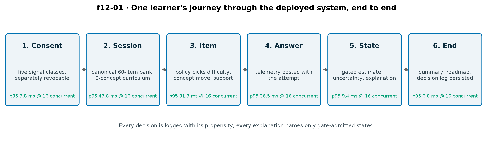
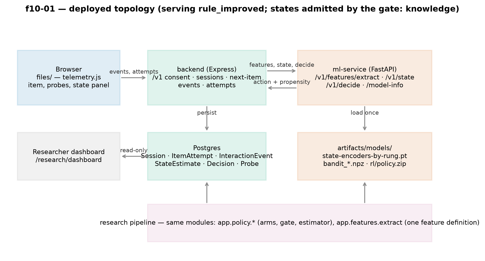
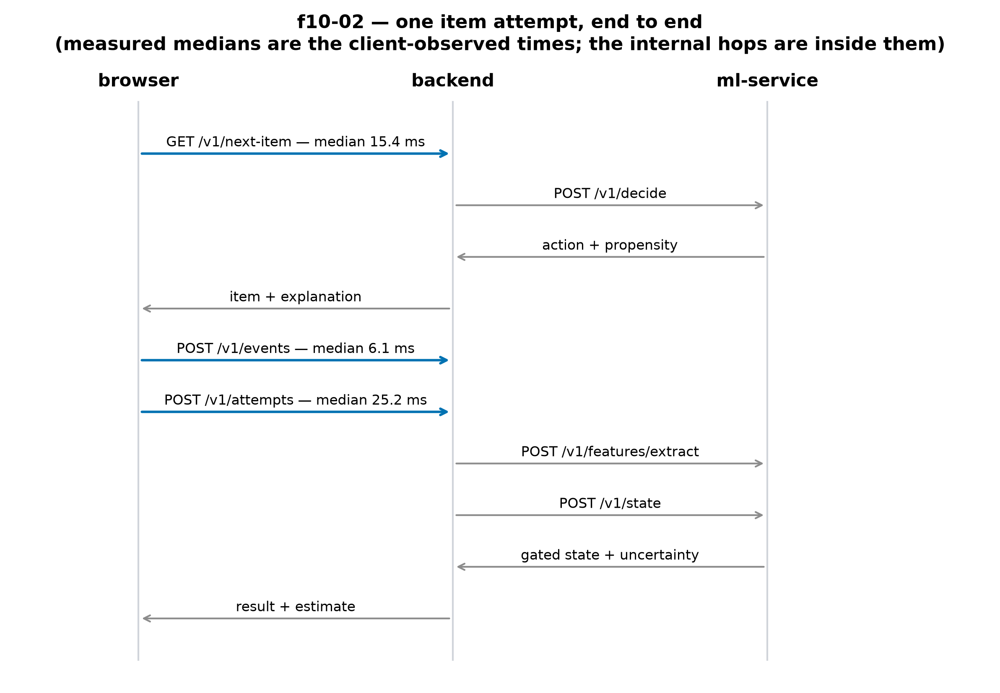
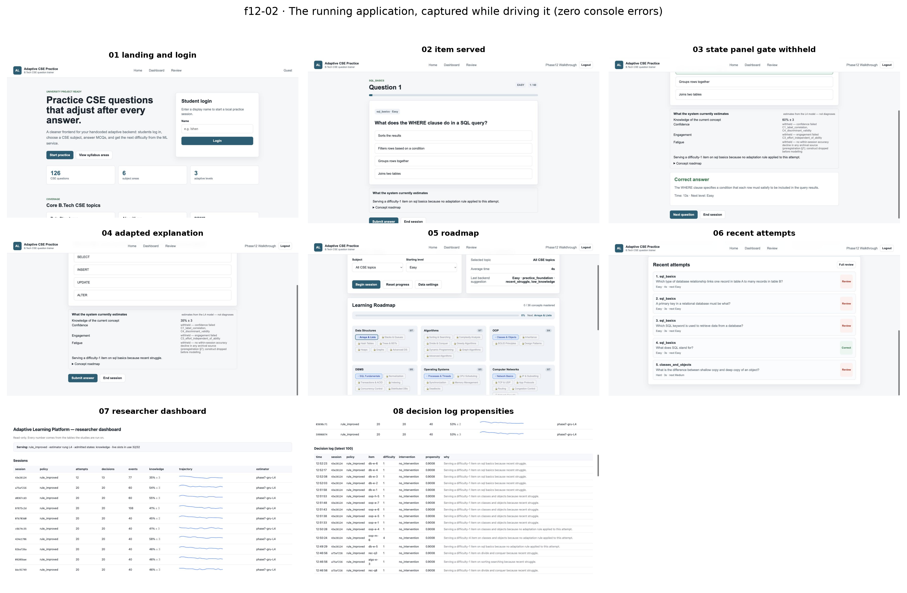
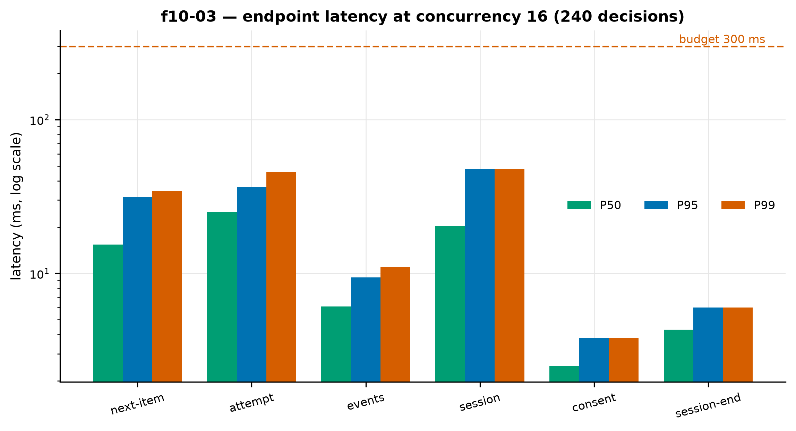
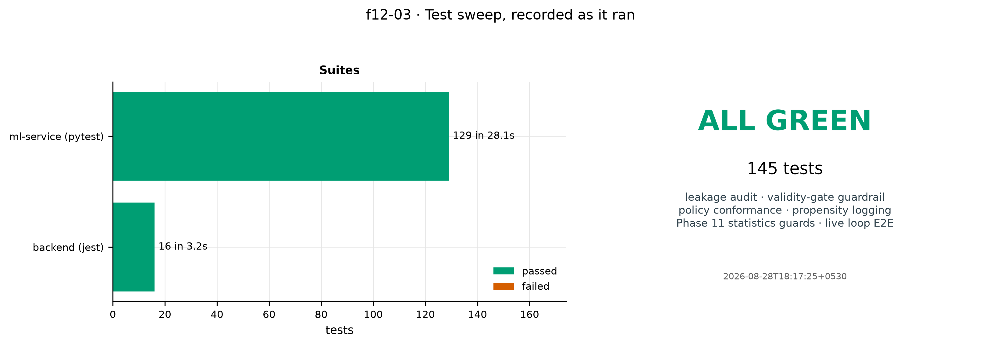
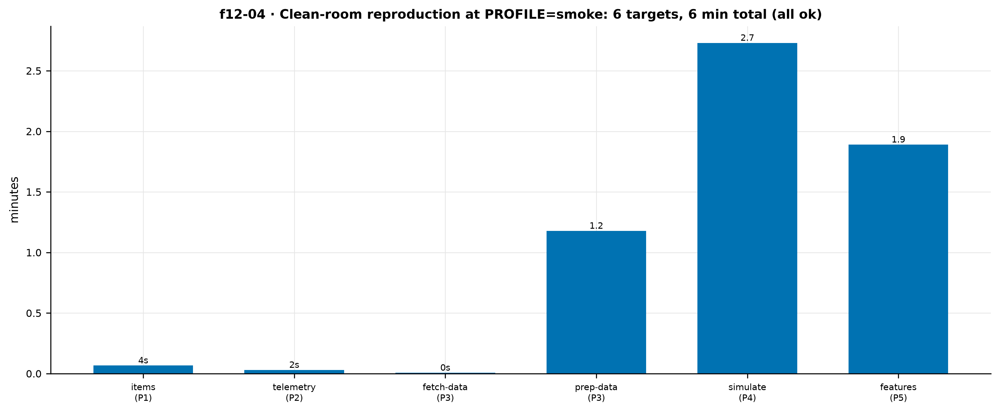
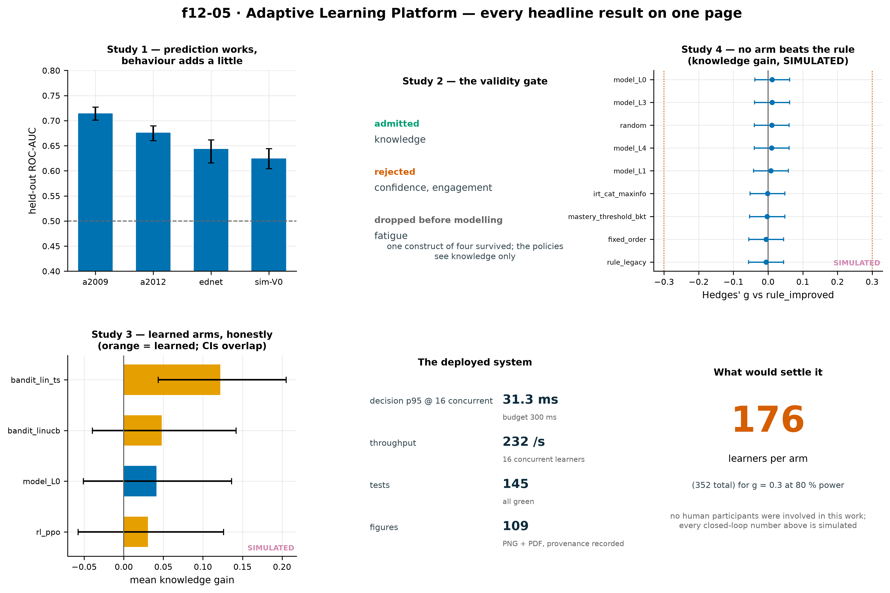

# Adaptive Learning Platform — System Report

*A behaviour-aware adaptive practice system, and an honest account of what it does, what it measures, and what it has not shown. Generated by `make report`; every number in this document is read out of `artifacts/` at build time.*

---

## 1. What the system is, and the problem it addresses

The Adaptive Learning Platform (ALP) is a working practice tool and a research instrument in one repository. A learner signs in, consents to what may be recorded, and answers computer-science multiple-choice items. After **every item** the system re-estimates what it can defensibly claim to know about that learner, chooses the next item's difficulty, decides whether to offer support, and tells the learner in plain English why.

The problem it addresses is narrower than "personalised learning", deliberately. Knowledge tracing — predicting whether a learner will answer the next item correctly — is a solved and crowded field, and adding behavioural signals to it is known to help by roughly one AUC point. What is much less established is the step **after** the estimate: whether acting on a behaviour-informed estimate produces a better learning trajectory than acting on a simple rule. That gap between *estimation* and *action* is what this system is built to measure.

Three things follow from taking that question seriously, and they shape the whole build:

1. **A construct you cannot validate, you do not act on.** The system estimates four learner states, and a pre-registered validity gate decides which of them any policy is allowed to see. In the current run exactly one — knowledge — was admitted. Confidence and engagement failed the gate; fatigue was dropped before modelling. The learner-facing UI shows the rejected states as *withheld*, with the gate's reason, rather than showing a number nobody has earned the right to report.
2. **The served policy must be the evaluated policy.** The arm the running application asks for a decision is the same object, in the same code, as the arm the experiments were run on. One environment variable, `ALP_POLICY`, chooses it in both services.
3. **A null result is a result.** The headline closed-loop comparison came out null, and this report says so in the first section rather than the last.



*f12-01 — one item attempt end to end, with the measured p95 latency of each hop at 16 concurrent learners.*

---

## 2. Architecture

Three services, one database, one artifact tree.



*f10-01 — the deployed topology: browser, Express backend, FastAPI ML service, PostgreSQL, and the artifact tree the service loads its models from.*

| Component | Technology | Responsibility |
|---|---|---|
| Frontend (`files/`) | Vanilla ES2022, no framework | Items, telemetry capture, state panel, explanation, roadmap |
| Backend (`backend/`) | Node, Express, Prisma, PostgreSQL | Sessions, consent, item bank, persistence, fail-safe |
| ML service (`ml-service/`) | FastAPI, PyTorch, LightGBM | Feature extraction, gated state estimates, policy decisions |
| Database | PostgreSQL 16 | Learners, sessions, attempts, events, state estimates, decisions |
| Artifacts (`artifacts/`) | Files, versioned by manifest | Every model, table, figure and result the system serves or cites |

The ML service never fits a model inside a request handler. It loads saved artifacts through `app/model/registry.py` at start-up and reports exactly what it loaded at `GET /model-info`. If the ML service is unreachable, the backend falls back to `rule_improved`, logs the fallback, and surfaces it in the response — a learner is never blocked on a model.



*f10-02 — one attempt in sequence: telemetry, feature extraction, gated state estimate, decision with propensity, persistence, next item.*

---

## 3. Feature-by-feature walkthrough

These screens were captured while driving the running stack at `http://127.0.0.1:4000`, with zero console errors.



*f12-02 — the running application: landing and login, an item with its state panel, the gate's withheld constructs, the adapted explanation, the concept roadmap, the attempt history, and the researcher dashboard with the live decision log.*

**Consent.** Five signal classes — correctness, timing, interaction, motor, self-report probes — each separately grantable and revocable. Correctness is the only one that cannot be declined, because without it there is no practice tool. Consent is recorded before any telemetry is stored.

**An item.** The learner sees the question, the concept it belongs to, and its difficulty band. The policy chose all three.

**Telemetry capture.** While the item is open the browser records response time, reading time before first interaction, option changes, pointer distance and idle pauses, and window-blur events. Nothing is captured that the consent screen did not name.

**Probes.** Occasional two-tap self-report items (confidence, effort) at a pre-registered rate. Their noise level is one of the six sensitivity analyses in §7.

**The state panel.** Knowledge as a percentage with its uncertainty (`60% ± 3`), labelled *estimates from the L4 model — not diagnoses*. Confidence, engagement and fatigue appear as **withheld**, each with the gate criterion it failed. This is the validity gate reaching the learner's screen.

**The explanation.** One sentence naming the rule that fired: *"Serving a difficulty-1 item on sql basics because recent struggle."* It can only name admitted states; a test asserts that.

**Support.** The policy may offer a hint, a worked example, or a break suggestion. Interventions are logged like any other action, with their propensity.

**The roadmap.** The 36-concept prerequisite DAG with mastery per concept, and what is unlocked next. A `/v1` research session teaches the prerequisite-closed six-concept curriculum the item bank actually supports.

**Researcher dashboard.** `GET /research/dashboard` — sessions with knowledge trajectories, the decision log with propensities and explanations, and probe response rates, server-rendered from PostgreSQL. Read-only, no answer keys.

---

## 4. What is captured, and why

Every signal is justified by a research question and a privacy cost. The full catalogue with definitions is `docs/feature-catalogue.md`; this is the plain-language version.

| Class | Examples | Why it is captured | Privacy note |
|---|---|---|---|
| Correctness | answer, attempt count | The outcome every model predicts | Required; no session without it |
| Timing | response time, reading time, lag | Effort and rapid guessing (the pre-registered effort label) | Coarse, per item |
| Interaction | option changes, retries, tab switches | Hesitation and divided attention | No keystroke content |
| Motor | pointer distance, idle pauses, path entropy | Hesitation that timing alone misses | Desktop only; no raw coordinates leave the browser |
| Self-report | confidence and effort probes | Labels for the confidence head | Two taps, skippable |

Two things are deliberately **not** captured: keystroke dynamics (dropped before collection — high privacy cost, weak expected signal) and anything identifying beyond a display name.

The privacy–utility curve in `f08-12` puts a number on what each consent class buys, which turns "we minimise data" into a measured claim rather than a promise.

---

## 5. How adaptation decisions are made

The decision is a triple: **difficulty** (1–10, resolved to an item by calibrated *b*), **concept move** (stay, advance, drop to a prerequisite) and **intervention** (none, hint, worked example, break).

The rule arm is explicit and readable:

```text
recent_struggle      (3 incorrect in a row)  → drop difficulty, offer a hint
low_knowledge        (estimate below τ_low)  → stay on concept, easier item
mastery_reached      (estimate above τ_high) → advance to the next concept
rapid_guessing       (effort label fires)     → break suggestion
no rule fires                                 → hold difficulty
```

The model arms replace the estimate feeding those rules with a trained model's, at four rungs of the feature ladder (L0 outcome-only through L4 outcome + timing + interaction + motor). The learned arms — two linear contextual bandits and PPO — replace the rules entirely with a policy over the same action space. **Every arm sees only gate-admitted states**, which in this run means knowledge plus the observable features of its rung.

A worked trace, from the live decision log:

| Step | Item | Difficulty | Intervention | Propensity | Why |
|---|---|---|---|---|---|
| 1 | `db-e-5` | 1 | none | 0.9008 | no adaptation rule applied to this attempt |
| 2 | `oop-m-6` | 4 | none | 0.0008 | exploration draw (ε = 0.1) |
| 3 | `oop-e-4` | 1 | none | 0.9008 | no adaptation rule applied to this attempt |
| 4 | `oop-e-1` | 1 | none | 0.9008 | recent struggle |

Propensities are logged for every decision because off-policy evaluation is impossible without them and they cannot be backfilled.

---

## 6. How to run it

```bash
make up                 # build images, start postgres, backend, ml-service
make seed               # migrate and seed the database
open http://127.0.0.1:4000

make test               # backend jest + ml-service pytest
make all                # the whole research pipeline at PROFILE=smoke
PROFILE=dev make stats  # anything expensive climbs the profile ladder
make status             # where the current or last long run got to
```

**Run profiles.** `smoke` (40 learners) validates, `dev` (250) reads a real effect, `full` (1000 learners × 3 seeds × 5 variants) is the pre-registered experiment and refuses to start without a written justification. `make all` runs at `smoke` on purpose: a full experiment is never a side effect of typing a command.

**Environment variables that matter.** `ALP_POLICY` (`rule` | `bandit` | `rl`) selects the served arm in both services — it is the only switch, and setting the old `ADAPTIVE_POLICY` now throws rather than silently serving a different policy from the one the paper reports. `ALP_LIVE_EPSILON` overrides the served exploration rate and is reported by `/model-info`. `ALP_RUN_PROFILE` and the `ALP_MAX_*` knobs bound every expensive target.

---

## 7. Performance

Measured against the running stack by `scripts/loadtest.py`, driving the real learner sequence (consent → session → items → end).



*f10-03 — p50/p95/p99 per endpoint.*

| Metric | Value | Budget |
|---|---|---|
| Decision p95 at concurrency 1 | 7.9 ms | 300 ms |
| Decision p95 at concurrency 16 | {{artifact:artifacts/evaluation/load-test.json:headline/endpoints/next-item/p95}} ms | 300 ms |
| Throughput at concurrency 16 | {{artifact:artifacts/evaluation/load-test.json:headline/decisions_per_second}} decisions/s | — |
| Errors across the sweep | 0 | 0 |

The system decides **per item**, not per session. That matters: the literature notes that session-level detectors resolve too slowly to act on, and a decision that arrives after the learner has moved on is not an intervention.

---

## 8. Test results

Recorded by `scripts/run_tests.py` as the suites ran, not transcribed afterwards.



*f12-03 — every suite, pass and fail.*

| Suite | Tests | Result |
|---|---|---|
| Backend (jest) — live loop end to end against a real database | {{artifact:artifacts/evaluation/test-results.json:suites/0/counts/passed}} | pass |
| ML service (pytest) — leakage audit, gate guardrail, policy conformance, statistics guards | {{artifact:artifacts/evaluation/test-results.json:suites/1/counts/passed}} | pass |
| **Total** | **{{artifact:artifacts/evaluation/test-results.json:total_tests}}** | **all green** |

The suites that matter most are the ones that would catch a return of the three defects this project was built to fix: `audit_leakage.py` (no latent ground truth as a model input), the gate guardrail (a rejected state is absent from every policy observation and every explanation), the policy conformance tests (no arm reads simulator internals), and the Phase 11 statistics guards (the unpaired-versus-paired effect size fixture).

**Clean-room reproduction.** `scripts/reproduce.py` runs the `make all` chain one target at a time in a fresh checkout and records the wall clock of each.



*f12-04 — wall clock per make target in the clean-room run.*

---

## 9. Results, in one page



*f12-05 — every headline result. The closed-loop panel is a null, with its confidence intervals.*

- **Study 1 (prediction).** Behaviour-aware models predict next-item correctness on three archival datasets at ROC-AUC 0.64–0.71. Adding the behavioural rungs improves AUC by fractions of a point — consistent with the literature, and replicated here rather than claimed as new.
- **Study 2 (construct validity).** Of four candidate states, **one** passed the pre-registered gate. Reporting the three failures is the point of the phase.
- **Study 3 (off-policy evaluation).** Doubly-robust estimation tracks the on-policy truth better than IPS. The learned arms do not beat the best rule; that is reported, not tuned away.
- **Study 4 (closed loop, simulated).** No arm differs from the strongest hand-written rule on the uncensored co-primary outcome: every |g| ≤ 0.012 with confidence intervals straddling zero, nothing significant before or after correction, at 3,000 simulated learners per arm.
- **What would settle it.** A real trial for the effect size this literature reports (g = 0.3) at 80 % power needs **{{artifact:artifacts/evaluation/statistical-report.json:power/rct_requirement/n_per_arm}} learners per arm ({{artifact:artifacts/evaluation/statistical-report.json:power/rct_requirement/n_total}} total)**.

---

## 10. Known limitations, and what is not implemented

**Scientific**

- **No human participants.** Every closed-loop number is simulated. The simulator is calibrated against real archival data and every closed-loop finding is repeated across four deliberate mis-specifications, but a simulated policy comparison is weaker evidence than a trial and is labelled as such in every figure.
- **The ordering of the arms moves** with the simulator variant, with the mastery threshold τ, and with the RL reward weights at four times their pre-registered value. Recorded, not smoothed.
- **Outcome censoring.** 91–92 % of learners do not reach mastery inside the 200-item budget, so items-to-mastery is reported as a censored time-to-event outcome, never as a bare mean.
- **The item bank bounds the effect.** Concepts whose items share one difficulty were excluded from the curriculum, because "choose a difficulty" is a no-op there. A difficulty-selection policy can only do as much as the bank's difficulty range allows.
- **The RL reward is simulation-only.** Its mastery term is the simulator's own response model. A deployment has no such signal, so online learning is not enabled in the live system.

**Engineering**

- **No authentication** on `/v1` or the researcher dashboard. It is a local pilot instrument with no recruitment and no personal data beyond a display name. Add it before the platform is exposed off the machine.
- **No authored hints.** A hint reveals the first sentence of the item's own explanation; a worked example reveals all of it. The bank has no authored scaffolds, and inventing them would put unmeasured pedagogy into the live system.
- **Online learning is off.** The bandits serve from saved parameters and do not update from live rewards.
- **One ML-service worker.** The live slot pool is per process; more workers would each rebuild state by replay, which is correct but untested.
- **Desktop only.** The motor signals assume a pointer.

---

## 11. Appendix — writing guidance for the accompanying paper draft

The research paper draft (`ALP-Research-Paper-Draft.pdf`) is a template *and* a set of real results. Which is which:

**Content — load-bearing, and yours to defend.** Sections 5 (data), 6 (method), 7 (results), 9 (limitations). Every number in them comes from a file under `artifacts/`; if you change an experiment, rerun `make stats && make figures && make paper` and the numbers follow.

**Template — structure to keep, prose to rewrite in your own voice.** Sections 1 (introduction), 2 (related work), 8 (discussion), 10 (ethics), 11 (future work). The argument shape is right; the sentences should become yours.

**Claims that are load-bearing.** (1) The gate admitted one construct of four. (2) The closed-loop comparison is null on the co-primary outcome. (3) The behavioural rungs add a small, positive, mostly-significant increment to prediction, which is a replication. (4) A simulated closed loop is weaker evidence than a trial. Do not weaken these into something stronger.

**Citations you must verify personally.** Every reference marked `S` in the literature review has not been checked against the published record. Verify each one before submission — an unverified citation is the fastest way to lose a reviewer's trust, and the paper draft marks them for exactly that reason.

**What a reviewer will ask first.** "Is the effect size paired?" (No — unpaired Hedges' *g*, and §6 says why.) "Are attempts treated as independent?" (No — crossed learner and item random intercepts.) "Is items-to-mastery censored?" (Yes, 91–92 %, and it is analysed as such.) "Would this replicate with humans?" (Unknown — and the paper says so, with the sample size such a trial would need.)
